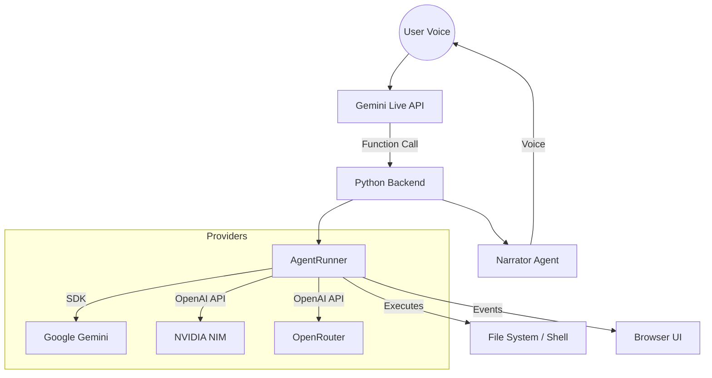

# VoiceClaw (J.A.R.V.I.S. V2)


**The world's first model-agnostic Voice Coding Agent Platform.**

[](https://github.com/yogen-ghodke-113/VoiceClaw/blob/master/LICENSE)
[](https://github.com/yogen-ghodke-113/VoiceClaw/stargazers)

VoiceClaw is a voice-first AI agent platform that turns your codebase into an interactive conversational environment. Powered by the **J.A.R.V.I.S.** persona, it allows you to speak naturally to your computer to write code, run tests, and manage projects.

## 🚀 Key Features

- **Model Agnostic**: Seamlessly switch between **Google Gemini**, **NVIDIA NIM**, and **OpenRouter**.
- **Voice-First Integration**: Uses Gemini Live for low-latency voice interaction.
- **Native Agent Architecture**: Implement its own tool-calling agent runner.
- **Real-time Narration**: A secondary "Narrator" agent provides spoken commentary.
- **System-Wide Access**: The Agent can read/write files, run shell commands, and explore your project.
- **Unified Timeline**: A filterable event log showing every thought, tool call, and file change.
- **Git Checkpoints**: Automatic snapshots before code modifications.

## 🛠️ How It Works



## 📋 Prerequisites

- **Python 3.11+**
- **Node.js 20+**
- API Keys for your preferred providers:
  - **Google Gemini API Key** (Required for Voice/STT)
  - **NVIDIA API Key** (Optional)
  - **OpenRouter API Key** (Optional)

## ⚡ Quick Start

1. **Clone and Install Backend**:

   ```bash
   git clone https://github.com/yogen-ghodke-113/VoiceClaw.git
   cd VoiceClaw
   pip install -r requirements.txt
   ```

2. **Setup Environment**:

   Create a `.env` file based on `.env.example`:

   ```env
   GEMINI_API_KEY=your_key_here
   NVIDIA_API_KEY=optional_key
   OPENROUTER_API_KEY=optional_key
   ```

3. **Install Frontend**:

   ```bash
   cd frontend
   npm install
   cd ..
   ```

4. **Launch**:

   ```bash
   python server.py
   ```

   Open <http://localhost:3333> to start your session.

## 🎙️ Voice Commands

- *"What does this main function do?"*
- *"Add a dark mode toggle to the CSS."*
- *"Run the unit tests and tell me if they pass."*
- *"Switch to DeepSeek V3 on NVIDIA."*
- *"Undo that last change."*

## 🏗️ Architecture

- **`AgentRunner`**: The heart of the system. Manages LLM sessions and tool execution.
- **`STTService`**: Real-time speech-to-text via Gemini.
- **`ContextBridge`**: Maintains context between voice interactions and agent tasks.
- **`NarrationConnection`**: Provides the "voice" of the platform's activity.

## 📄 License

Apache License 2.0 — see [LICENSE](LICENSE) for details.
